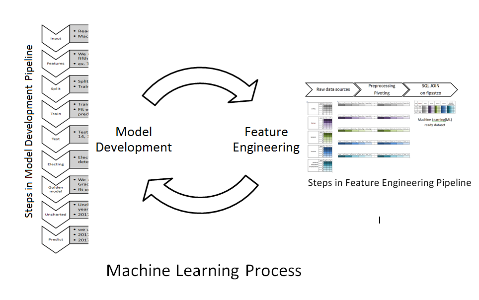
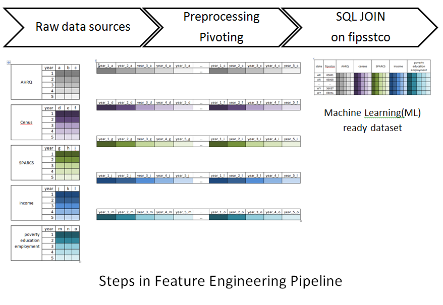
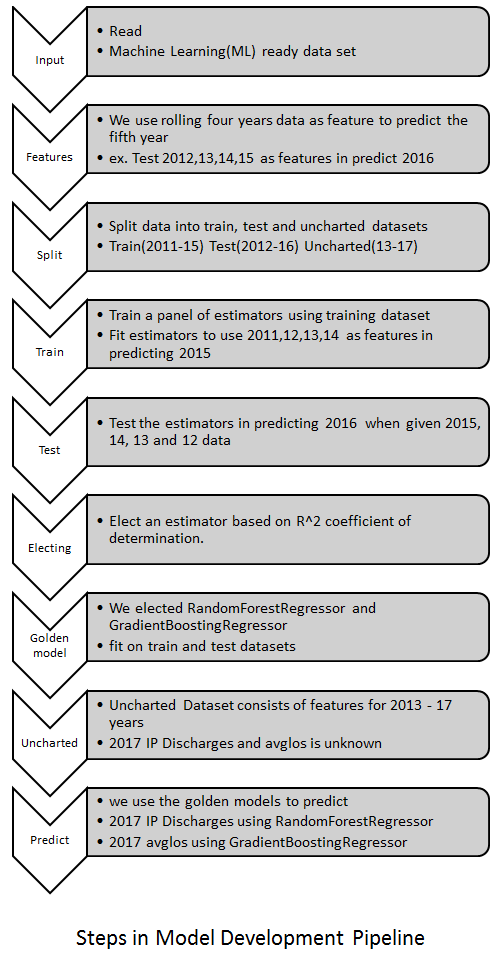

# Table of Contents

+ [Introduction](#introduction)
    + [About Us](#about-us)
    + [Method](#method)

+ [Machine Learning Features](#machine-learning-features)
    + [AHRQ provided dataset](AHRQ-provided-dataset)
    + [census data](#census-data)
    + [SPARCS data](#sparcs-data)
    + [income](#income)
    + [poverty education](#poverty-education)

+ [Data](#data)
    + [Submission file](#submission-file)

+ [Code](#code)
    + [Dependencies](#dependencies)

+ [Conclusion](#conclusion)

+ [References](#reference)

# Introduction

## About us

We work for a not-for-profit hospital group in Upstate NY at Business Analytics and Innovation Department.

We at [Arnot Health Inc.](https://www.arnothealth.org/aboutus) have a small team which functions as our Business Analytics department. The team has had significant success in surfacing valuable information from our sea of data sources. We have been trying to reduce costs by developing in-house solutions for [predictive](https://www.hanys.org/tripleaim/case-studies/?a=vs&s=Arnot_Health_Uses_Predictive_Analytics_to_Advance_Care_Coordination) and general analytics.

## Method





We used a popular machine learning library in Python language called [scikit-learn](https://scikit-learn.org/stable/about.html#citing-scikit-learn) for this task.

After evaluating several machine learning algorithms we have chosen

* [RandomForestRegressor](https://scikit-learn.org/stable/modules/generated/sklearn.ensemble.RandomForestRegressor.html) to predict `n` i.e. IP Discharges
* [GradientBoostingRegressor](https://scikit-learn.org/stable/modules/generated/sklearn.ensemble.GradientBoostingRegressor.html) to predict `avglos` i.e Avg. Length of Stay

Refer to Model Evaluation Results for more details.

We performed hyper parameter optimizations using [`GridSearchCV`](https://scikit-learn.org/stable/modules/generated/sklearn.model_selection.GridSearchCV.html#sklearn.model_selection.GridSearchCV)

We attempted recursive feature elimination using [RFE](https://scikit-learn.org/stable/modules/generated/sklearn.feature_selection.RFE.html#sklearn.feature_selection.RFE)

# Machine Learning Features

All the features used are snapshotted to `AHRQ_ML_ready_dataset.xlsx` in the `data` folder.

A metadata file is also created for each column in `AHRQ_ML_ready_metadata.xlsx` in `data` folder.

We primarily have 5 sources of features

## AHRQ provided dataset

`state` and `fipsstco` were high ranked features

## census data

https://factfinder.census.gov/faces/nav/jsf/pages/download_center.xhtml#

PEPAGESEX - Annual Estimates of the Resident Population for Selected Age Groups by Sex for the United States, States, Counties, and Puerto Rico Commonwealth and Municipios: April 1, 2010 to July 1, 2017

Annual Estimates of the Resident Population for Selected Age Groups by Sex for the United States, States, Counties and Puerto Rico Commonwealth and Municipios: April 1, 2010 to July 1, 2017
Source: U.S. Census Bureau, Population Division
Release Date: June 2018

ref `data\census\census_l1.xlsx`

## SPARCS data

We use SPARCS data in combination with census data to get to a naive estimate of hospital utilization based on demographics groups by gender and by age groups

ref `data\sparcs\sparcs_l1.xlsx` and `data\sparcs\hospital_utilization_l1.xlsx`

Our hypothesis with this dataset is to evaluate each county by it's gender and age group for hospital utilization like NY state.

https://www.health.ny.gov/statistics/sparcs/

Hospital Inpatient Discharges (SPARCS De-Identified)

https://health.data.ny.gov/Health/Hospital-Inpatient-Discharges-SPARCS-De-Identified/gnzp-ekau

## income

Income in the past 12 months

We have include `.aff` files which can be used at https://factfinder.census.gov/faces/nav/jsf/pages/index.xhtml

to downlaod the file directly

Click `Load Search or Query` for `.aff` file

ref `data\income`

we get data at following granularity from this dataset

* Households;_Estimate;_$10,000_to_$14,999
* Households;_Estimate;_$100,000_to_$149,999
* Households;_Estimate;_$15,000_to_$24,999
* Households;_Estimate;_$150,000_to_$199,999
* Households;_Estimate;_$200,000_or_more
* Households;_Estimate;_$25,000_to_$34,999
* Households;_Estimate;_$35,000_to_$49,999
* Households;_Estimate;_$50,000_to_$74,999
* Households;_Estimate;_$75,000_to_$99,999
* Households;_Estimate;_Less_than_$10,000
* Households;_Estimate;_Mean_income_(dollars)
* Households;_Estimate;_Median_income_(dollars)


## poverty education

S1701 - POVERTY STATUS IN THE PAST 12 MONTHS

ref `data\poverty_education` for `.aff` file

This dataset has poverty education and employment data

```
Total;_Estimate;_EMPLOYMENT_STATUS_-_Civilian_labor_force_16_years_and_over_-_Unemployed
Total;_Estimate;_EMPLOYMENT_STATUS_-_Civilian_labor_force_16_years_and_over_-_Employed
Total;_Estimate;_EMPLOYMENT_STATUS_-_Civilian_labor_force_16_years_and_over
Total;_Estimate;_EDUCATIONAL_ATTAINMENT_-_Population_25_years_and_over_-_Some_college,_associate's_degree
Total;_Estimate;_EDUCATIONAL_ATTAINMENT_-_Population_25_years_and_over_-_Less_than_high_school_graduate
Total;_Estimate;_EDUCATIONAL_ATTAINMENT_-_Population_25_years_and_over_-_High_school_graduate_(includes_equivalency)
Total;_Estimate;_EDUCATIONAL_ATTAINMENT_-_Population_25_years_and_over_-_Bachelor's_degree_or_higher
Total;_Estimate;_EDUCATIONAL_ATTAINMENT_-_Population_25_years_and_over
Total;_Estimate;_ALL_INDIVIDUALS_WITH_INCOME_BELOW_THE_FOLLOWING_POVERTY_RATIOS_-_50_percent_of_poverty_level
Total;_Estimate;_ALL_INDIVIDUALS_WITH_INCOME_BELOW_THE_FOLLOWING_POVERTY_RATIOS_-_200_percent_of_poverty_level
Total;_Estimate;_ALL_INDIVIDUALS_WITH_INCOME_BELOW_THE_FOLLOWING_POVERTY_RATIOS_-_185_percent_of_poverty_level
Total;_Estimate;_ALL_INDIVIDUALS_WITH_INCOME_BELOW_THE_FOLLOWING_POVERTY_RATIOS_-_150_percent_of_poverty_level
Total;_Estimate;_ALL_INDIVIDUALS_WITH_INCOME_BELOW_THE_FOLLOWING_POVERTY_RATIOS_-_125_percent_of_poverty_level
```

# Data

## Submission file

Is saved under `data\submission file`

* `ahrq_learner_output_v3_2019-06-27T22.03.31.xlsx`

Predicted fields

* `avglos_2016_predicted`
* `avglos_2017_predicted`
* `n_2016_predicted`
* `n_2017_predicted`


## Model Evaluation Results

We used coefficient of determination R^2 of the prediction for scoring our models.

Results are available in `\data\model evaluation`

* ahrq_avglos_proj_results_v1_2019-06-27T22:03:31.xlsx
* ahrq_n_proj_results_v1_2019-06-27T22:06:09.xlsx


# Code

## Dependencies

Dependencies are mentioned in `requirements.txt` can be installed using `pip`(https://pypi.org/project/pip/).

## Execution

`python AHRQ\learner.py`

# Conclusion

We apologize for any omissions.

## Further Research

We wish to add new features from other publicly available sources for counties level hospital quality and population health metrics.

We also wish to perform a continuous improvement cycle of recursive feature elimination for Principal component analysis and feature reduction.

# Reference

* [scikit-learn](https://scikit-learn.org/stable/about.html#citing-scikit-learn)
